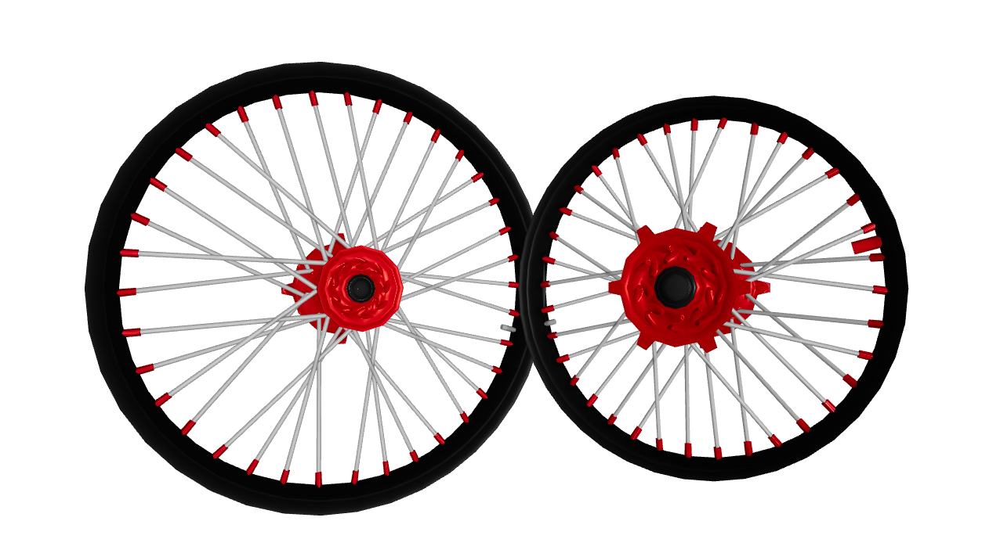

# Motocross Wheel Visualization



## Description

This project is a 3D visualization of motocross wheels using [Three.js](https://threejs.org/) and React Three Fiber (`@react-three/fiber`). The goal is to display both front and rear wheels with the ability for users to dynamically change colors on various wheel parts such as the hub, spokes, rim, and nipples.

The models are loaded from GLB files and use textures, including specular maps for enhanced material effects. Colors can be updated in real-time via UI controls, and the wheels rotate continuously with camera orbit controls enabled.

## Features

- Real-time 3D rendering of front and rear motocross wheels.

- Dynamic color customization for different wheel parts:

  - Hub

  - Spokes

  - Rim

  - Nipples

Color settings can also be passed through URL parameters.

[Example visualization](https://motocross-wheel-visualization.vercel.app/?wheels=Rear&rim_color=%23FFA500&hub_color=%23FFD700&spokes_color=%23C0C0C0&nipples_color=%23FF0000)

## Technologies

- [Next.js 15](https://nextjs.org/)

- [React Three Fiber](https://r3f.docs.pmnd.rs/getting-started/introduction)

- [Three.js](https://threejs.org/)

## Installation

Clone the repository

```bash
git clone https://github.com/Djurson/motocross-wheel-visualization.git
```

Move into the repository

```bash
cd motocross-wheel-visualization
```

Install the dependencies

```bash
npm install
```

Run the web application

```bash
npm run dev
```

## Project structure

```python
.
├── app/
│   └── page.tsx                    -- Main page
│
├── components/
│   ├── ThreeScene.tsx              -- Main component rendering the Canvas
│   └── Wheel.tsx                   -- Component for loading respective GLB model and handling materials/colors
│
├── public/
│   ├── FrontWheel.glb              -- 3D model of the front wheel
│   └── RearWheel.glb               -- 3D model of the rear wheel
│
└── README.md                       -- This file
```
